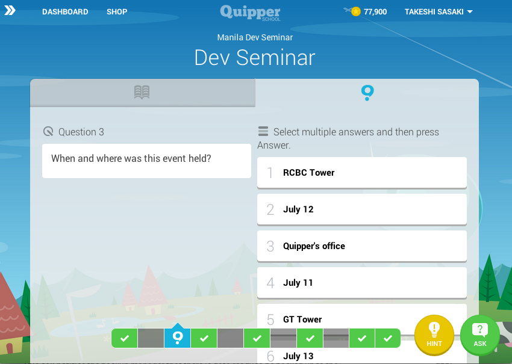

# Offlineノススメ

dagezi@{twitter, github, gmail.com}

## おわび

補欠だと思って油断してたのでちゃんとネタ仕込んでませんでした。すみません。

## 気を取り直して

## いまなぜ offlineか?

- この LTE時代に
- 使い放題が普通なのに
- クラウドなのに

## いやまて!

## ユーザが求めているのは?

- 素早い起動時間、反応 <!-- .element: class="fragment" data-fragment-index="1" -->
 - スキマ時間に使いたい!
- 低消費電力  <!-- .element: class="fragment" data-fragment-index="2" -->
- 電波がなくても使いたい  <!-- .element: class="fragment" data-fragment-index="3" -->
 - エレベーター、トンネル
- 電磁波少なめで健康的 <!-- .element: class="fragment" data-fragment-index="4" -->

## 代表的offlineアプリ
- GMail
- Calendar
- Contact

## offlineで動くのが Nativeアプリのたしなみ

## 実例:某 Quipper社

フィリピン、インドネシア等でオンライン教育サービス

## 現状は Webアプリ

## スマフォはそこそこ普及
- だが、使い放題契約はすくない
- PrepaidSIMによる従量課金

## offline学習アプリ
- 学校の WiFiとかでダウンロードしてもらう
- えらそうにいいつつ、まだ開発中

## 技術要素

- データベースに溜め込む
- [SyncAdapter](http://developer.android.com/training/sync-adapters/index.html)
 - [mixiの Android Training内の解説](https://github.com/mixi-inc/AndroidTraining/wiki/2.15.-ContentProvider-%E3%81%AE%E7%99%BA%E5%B1%95#abstractthreadedsyncadapter)
- ユーザに sync動作をさせる
 - offlineゆえの動作の制限はある

## 参考文献

- スマ思 (by Kazuma Arino)
 - [Vol.1](https://www.youtube.com/watch?v=4XbPVEsob6k)
 - [Vol.2](https://www.youtube.com/watch?v=xxsuDlvgb5M)
 - [Vol.3](https://www.youtube.com/watch?v=ZyIWRqKkuMY)
